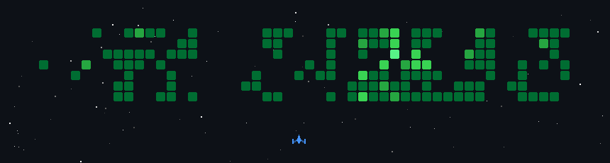

  
  
  

## 📌 About Me & Focus Areas
- 👨‍💻 Full-Stack Software Engineer specializing in **B2B SaaS architecture, Enterprise 3D Data Visualization, and Multi-Agent AI Integrations**.
- 💼 Driving product growth and platform architecture for **TableTap**, a modern POS for African hospitality.
- 🚀 Scrum Master and Lead Mobile Developer for **NiftyPantry**, a cross-platform Flutter application.
- 🎓 Software Engineering Student at Universiti Teknologi Malaysia (UTM).

## 🛠️ Core Languages & Tools

**Frontend, 3D & UI**
 

  

**Backend & CMS**
 

  

**Database & Cloud Storage**
 

  

**Mobile, AI & APIs**
 

  

**DevOps, Architecture & Languages**
 

## 📊 GitHub Analytics

  
  &nbsp;&nbsp;&nbsp;&nbsp;
  

 

  

